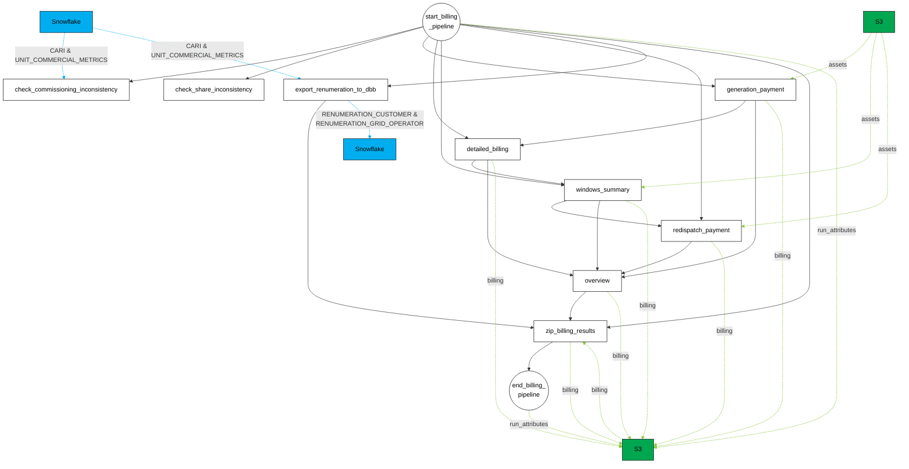

# Billing Pipeline

Mermaid transcription of the billing pipeline DAG.

- **Solid black arrows** — task dependencies (control flow)
- **Dotted green arrows** — S3 data flow (`run_attributes`, `assets`, `billing`)
- **Dotted blue arrows** — Snowflake data flow (`CARI & UNIT_COMMERCIAL_METRICS`, `RENUMERATION_*`)

## Flow summary

### Control flow

| Task | Upstream dependencies |
| --- | --- |
| `check_commissioning_inconsistency` | `start_billing_pipeline` |
| `check_share_inconsistency` | `start_billing_pipeline` |
| `export_renumeration_to_dbb` | `start_billing_pipeline` |
| `generation_payment` | `start_billing_pipeline` |
| `detailed_billing` | `start_billing_pipeline`, `generation_payment` |
| `windows_summary` | `start_billing_pipeline`, `detailed_billing` |
| `redispatch_payment` | `start_billing_pipeline`, `windows_summary` |
| `overview` | `generation_payment`, `detailed_billing`, `windows_summary`, `redispatch_payment` |
| `zip_billing_results` | `start_billing_pipeline`, `overview`, `export_renumeration_to_dbb` |
| `end_billing_pipeline` | `zip_billing_results` |

### Data flow

| Source | Dataset | Target |
| --- | --- | --- |
| `start_billing_pipeline` | `run_attributes` | S3 |
| `end_billing_pipeline` | `run_attributes` | S3 |
| S3 | `assets` | `generation_payment`, `windows_summary`, `redispatch_payment` |
| `generation_payment`, `detailed_billing`, `windows_summary`, `redispatch_payment`, `overview`, `zip_billing_results` | `billing` | S3 |
| S3 | `billing` | `zip_billing_results` |
| Snowflake | `CARI` & `UNIT_COMMERCIAL_METRICS` | `check_commissioning_inconsistency`, `export_renumeration_to_dbb` |
| `export_renumeration_to_dbb` | `RENUMERATION_CUSTOMER` & `RENUMERATION_GRID_OPERATOR` | Snowflake |
